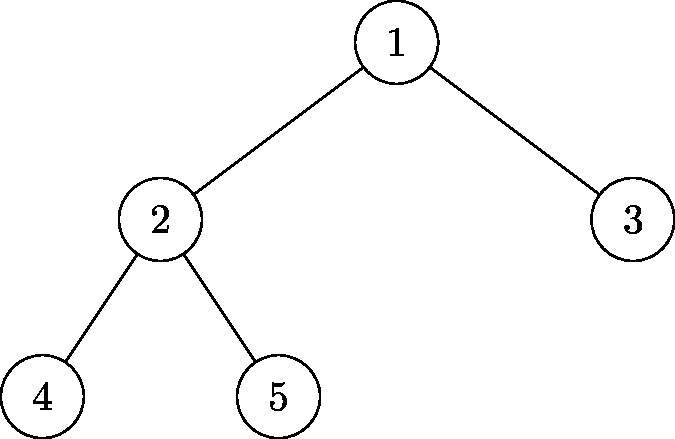

## Script pour générer des images d'arbres binaires

**Prérequis**:
- **LaTeX** d'installé avec TiKZ
- **Image Magick** d'installé pour la conversion du PDF en image.

```python
import subprocess
import os

class Arbre:
    def __init__(self, valeur=None):
        self.valeur = valeur
        self.gauche = None
        self.droit = None

    def est_vide(self):
        return self.valeur is None

    def to_tikz(self, level=1):
        if level == 1:
            tikz = f"\\node {{{self.valeur}}}\n"
        else:
            tikz = f"node {{{self.valeur}}}\n"
        
        if self.gauche or self.droit:
            tikz += "child {"
            if self.gauche:
                tikz += self.gauche.to_tikz(level + 1)
            else:
                tikz += "edge from parent[draw=none]"
            tikz += "}\nchild {"
            if self.droit:
                tikz += self.droit.to_tikz(level + 1)
            else:
                tikz += "edge from parent[draw=none]"
            tikz += "}\n"
        return tikz

    def generate_tikz(self, sibling_distance=30):
        tikz_code = f"\\begin{{tikzpicture}}[\n"
        tikz_code += f" every node/.style = {{minimum width = 2em, draw, circle}},\n"
        tikz_code += f" level/.style = {{sibling distance = {sibling_distance}mm/#1}}\n"
        tikz_code += "]\n"
        tikz_code += self.to_tikz()
        tikz_code += ";\n\\end{tikzpicture}"
        return tikz_code

    @classmethod
    def create_tikz(cls, arbre, sibling_distance=30):
        return arbre.generate_tikz(sibling_distance)

    def generate_jpeg(self, output_file, sibling_distance=30):
        tikz_code = self.generate_tikz(sibling_distance)
        
        # Créer un document LaTeX complet
        latex_document = f"""
        \\documentclass{{standalone}}
        \\usepackage{{tikz}}
        \\begin{{document}}
        {tikz_code}
        \\end{{document}}
        """
        
        # Créer un fichier temporaire pour le code LaTeX
        tex_filename = "temp.tex"
        with open(tex_filename, "w") as f:
            f.write(latex_document)

        try:
            # Compiler le fichier LaTeX en PDF
            subprocess.run(['pdflatex', '-interaction=nonstopmode', "temp.tex"], check=True, capture_output=True)
            
            # Nom du fichier PDF généré
            pdf_filename = tex_filename.replace('.tex', '.pdf')
            
            # Convertir le PDF en JPEG
            subprocess.run(['magick', '-density', '300', pdf_filename, '-quality', '90', output_file], check=True)
            
            print(f"Image JPEG générée : {output_file}")
        
        except subprocess.CalledProcessError as e:
            print(f"Erreur lors de la génération de l'image : {e}")
        
        finally:
            # Nettoyer les fichiers temporaires
            for ext in ['.tex', '.pdf', '.aux', '.log']:
                temp_file = tex_filename.replace('.tex', ext)
                if os.path.exists(temp_file):
                    os.remove(temp_file)

# Exemple d'utilisation
if __name__ == "__main__":
    arbre = Arbre(1)
    arbre.gauche = Arbre(2)
    arbre.droit = Arbre(3)
    arbre.gauche.gauche = Arbre(4)
    arbre.gauche.droit = Arbre(5)
    
    arbre.generate_jpeg("mon_arbre.jpg", sibling_distance=40)
```

Le rendu de l'exemple va donner:



On peut régler `sibling_distance` pour la largeur de l'arbre.

Le nom du fichier temporaire `temp.tex`est codé en dur dans le script, on pourrait aussi utiliser le module python `tempfile`...


