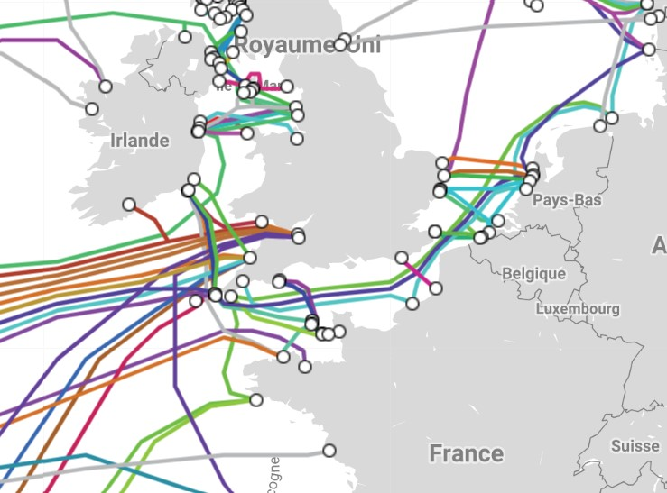
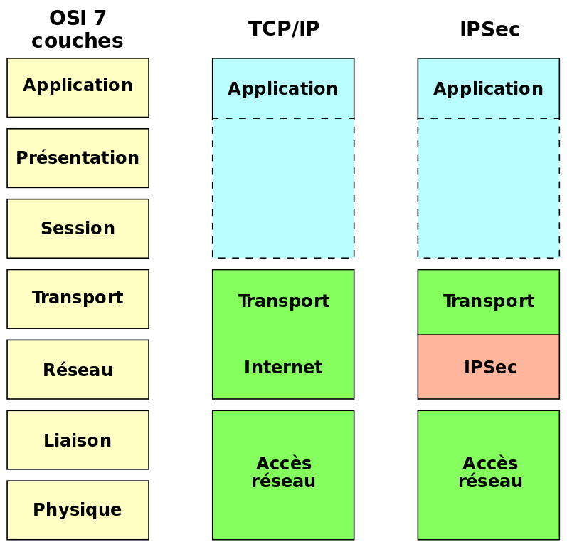
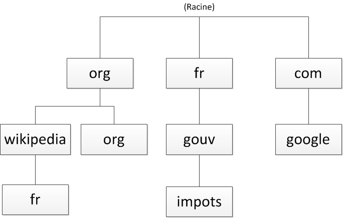

## Repères historiques

- 1958: Premières communications entre deux ordinateurs avec un modem (laboratoires Bell, USA)
- 1962: Recherches pour créer un réseau global d'ordinateurs indépendant des constructeurs
- 1969: Naissance d' **ARPANET** (_Advanced Researsh Projects Agency Network_)
- 1973: 23 ordinateurs connectés à ARPANet. Naissance du **projet Cyclades** en France.
- 1983: Naissance officielle d'Internet, d'Ethernet et des protocoles TCP/IP
- 1992: un million d'ordinateurs connectés à Internet.
- 1995: Recherches pour mettre en place IPv6 en vue de la pénurie d'adresses IPv4
- 1997: Apparition du Wi-Fi
- 2012: La **4G** généralise l'accès à l'Internet mobile en France.
- 2019: Plus de 1,5 milliards de sites Internet recencés dans le monde

Issu de recherches datant des années 1950 et apparu dans les années 1980, Internet est désormais le réseau public mondial d'échange de toutes formes d'informations numérisées.

## Internet et les réseaux physiques

Internet est un réseau logiciel mondial qui repose en réalité sur une grande variété d'infrastures
physiques (câbles, antennes et relais, satellites, fibres) par le biais
desquelles les données transitent.

### Les câbles sous-marins d'Internet

D'un seul câble transatlantique en 1858 et d'une vingtaine en 2015, on passe à plus de
450 câbles sous-marins aujourd'hui qui s'étendent sur plus de 1,2 millions de kilomètres,
reposants au fond des océeans.

Ces liaisons à fibres optiques supportent plus de 99 % du trafic internet mondial.
Leur nombre augmente chaque année pour faire face à l'augmentation considérable du flux de données.

Carte interactive: [https://www.submarinecablemap.com/](https://www.submarinecablemap.com/)

Données statistiques:

[Infographie: Internet : les GAFAM et la bataille des câbles sous-marins | Statista](https://fr.statista.com/infographie/15784/projets-de-cables-de-telecommunications-sous-marins-realises-par-les-gafam/)

:::info Vidéo
Vidéo qui date de 2017, mais est toujours dans l'ensemble d'actualité: [Câbles sous-marins, la guerre invisible](https://www.youtube.com/watch?v=Cb7ibgRivwU)
:::

:::info Info
L'ennemi numéro un des câbles sous-marins ne sont pas les avalanches sous-marines,
ni même les morsures de requins, mais d'abord et de loin les ancres de bateaux.
:::

## Distribution du trafic Internet mondial en 2020

[Infographie: Le streaming vidéo représente 61 % du trafic Internet | Statista](https://fr.statista.com/infographie/21207/repartition-du-trafic-internet-mondial-par-usage/)

[Infographie: Quelles applis partagent le plus de données personnelles avec des tiers ? | Statista](https://fr.statista.com/infographie/24497/applications-qui-partagent-collectent-le-plus-de-donnees-personnelles/)

## Le protocole TCP/IP

Grâce à son universalité, Internet est devenu le moyen de communication principal entre les hommes et les machines.
Pour communiquer, tous les appareils connectés utilisent des règles communes constituant un protocole de communication.

### Le protocole IP

Tous les objets connectés à Internet (tablettes, smartphones, etc...) peuvent échanger entre eux des informations respectant un certain protocole. C'est le **protocole IP** (_Internet Protocol_)

A chaque appareil est associé un numéro d'identification. c'est **l'adresse IP**.

C'est une adresse unique attribuée à chaque appareil connecté sur internet: c'est-à-dire qu'il n'existe pas sur internet deux ordinateurs ayant la même adresse IP.

- Les adresses **IPv4** se présentent le plus souvent sous forme de quatre nombres (entre 0 et 255), séparés par des points.

Par exemple: 204.35.129.3

- Les adresses **IPv6** sont codées en hexadécimal sur 16 octects (8 parties telles que chaque partie est sur 2 octets).

Par exemple: 3ac4:0567:0000:34b6:0000:0000:c6d4:43000

- Pour connaitre votre addresse IP: [my-ip-finder](https://www.my-ip-finder.fr/)
- Ce site permet aussi de trouver l'adresse IP d'un domaine quelconque.

:::tip A retenir
Le **protocole IP** (Internet Protocol) donne une adresse à toutes les machines du réseau.
Ses principales fonctions sont:

- de définir le format des données
- d'assurer l'adressage et le routage de ces paquets jusqu'à leur adresse de destination
- de fragmenter et réassembler les paquets si nécessaire.
  :::

### Le protocole TCP

**TCP** (_Transmission Control Protocol_): littéralement "le procotole de contrôle de transmission".

Il régit les échanges de paquets de données entre des machines connectées sur Internet.

- Il vérifie que le destinataire est prêt à recevoir les données dans les bonnes conditions.
- Il prépare les envois de paquets de données.L'émetteur découpe les gros paquets de données en paquets plus petits.
- Il vérifie que chaque paquet est bien arrivé. Au besoin, le TCP du destinataire remande les paquets manquants et les réassemble avant de les livrer dans la machine.

TCP ne garantit pas un delai précis. La durée d'envoie d'un paquet dépend des débits disponibles à l'instant du transfert.

### TCP/IP, le modèle en couches

- COUCHE APPLICATION: Englobe les applications standard du réseau (le logiciels présents sur une machine connectée) et l'indication du protocole de transport utilisé.
- COUCHE TRANSPORT (TCP): Fragmente les messages en paquets de données afin de pouvoir les acheminer sur la couche Internet d'une machine à une autre adresse IP et établit la communication entre les deux adresses.
- COUCHE INTERNET (IP): Détermine les chemins possibles à travers le réseau en précisant notament les adresses IP de l'expéditeur et du destinaire.
- COUCHE ACCES RESEAU: Spécifie la forme sous laquelle les données doivent être acheminées quel que soit le type de réseau utilisé.

source: [wikipedia.fr](https://fr.m.wikipedia.org/wiki/Fichier:Internetprotocolsecurity-fr.svg)

## Le serveur DNS

### Une adresse sur le réseau Internet

Toutes les machines (ordinateurs, serveurs, routeurs, smartphones, voitures (!)...) connectées à Internet possèdent une adresse IP. C'est cette adresse IP qui permet aux machines de communiquer entre elles.

Mais bien sûr, nous avons beau être des êtres humains avec une bonne mémoire, notre cerveau n'est pas fait pour retenir des séries de chiffres comme 104.20.55.240. On aimerait mieux avoir à retenir des noms comme fr.wikipedia.org, voire même n'avoir rien à retenir du tout (mais c'est un autre débat...).

Il ne s'agit donc pas d'un problème technique, Internet fonctionne très bien avec des adresses IP, mais d'un problème de nommage pour permettre un accès simplifié à Internet pou‌r nous tous, pauvres êtres humains. Ce système de nommage est le **Domain Name System (DNS)**.

Le **DNS** est un protocole indispensable au fonctionnement d'Internet. Non pas d'un point de vue technique, mais d'un point de vue de son utilisation. Il est inconcevable aujourd'hui d'utiliser des adresses IP en lieu et place des noms des sites web pour naviguer sur Internet. Se souvenir de 58.250.12.36 est déjà compliqué, mais quand vous surfez sur 40 sites différents par jour, cela fait quelques adresses à retenir. Et ça, on ne sait pas faire...

:::tip A retenir
Le système **DNS** se charge de convertir (on parle de **résolution**) le nom du site web demandé en adresse IP.
:::

### Principes de fonctionnement du DNS

Un nom de domaine se décompose en plusieurs parties. Prenons l'exemple suivant : **www.google.fr**

Chaque partie est séparée par un point.

- On trouve l'extension en premier (en premier, **mais en partant de la droite**) ; on parle de **Top Level Domain (TLD)**. Il existe des TLD nationaux (fr, it, de, es, etc.) et les TLD génériques (com, org, net, biz, etc.).

- Il existe une infinité de possibilités pour la deuxième partie. Cela correspond à tous les sites qui existent : google.fr, ovh.net, twitter.com, etc...

Comme vous le voyez, google.fr est un sous-domaine de fr. Le domaine fr englobe tous les sous-domaines finissant par fr.

- La troisième partie est exactement comme la seconde. On y retrouve généralement le fameux "www", ce qui nous donne des noms de domaine comme www.google.fr. www peut soit être un sous-domaine de google.fr, mais dans ce cas il pourrait y avoir encore des machines ou des sous-domaines à ce domaine, soit être directement le nom d'une machine.

Ici, www est le nom d'une machine dans le domaine google.fr.

On peut bien entendu ajouter autant de troisièmes parties que nécessaire.

### Gestion internationnale des DNS

Même si le système DNS n'est pas indispensable au fonctionnement d'Internet, il en est un élément incontournable.

Le système de noms de domaine est géré par un organisme américain appelé l'[ICANN](https://www.icann.org/fr). Celui-ci dépend directement du Département du Commerce des États-Unis. L'ICANN est responsable de la gestion des 13 serveurs DNS qui gèrent la racine du DNS. Ces 13 serveurs connaissent les adresses IP des serveurs DNS gérant les TLD (les .fr, .com; org, etc.)
